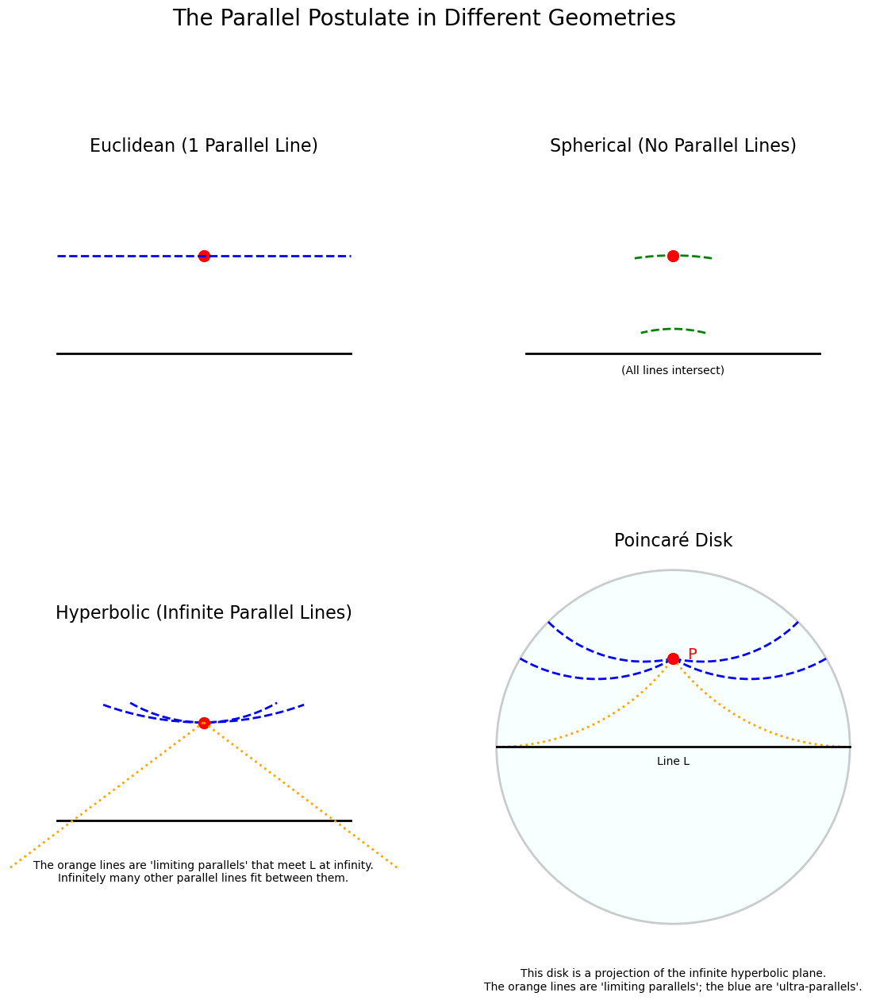
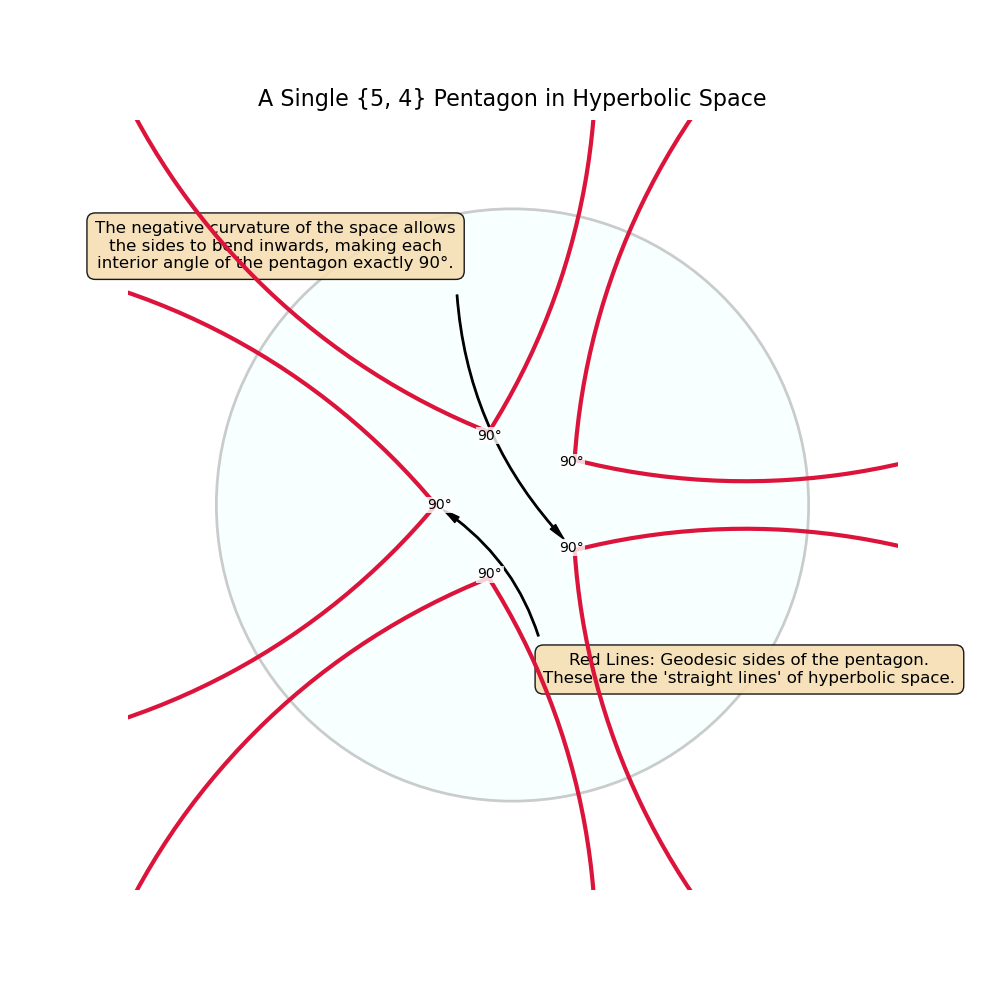
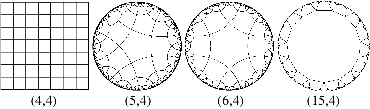
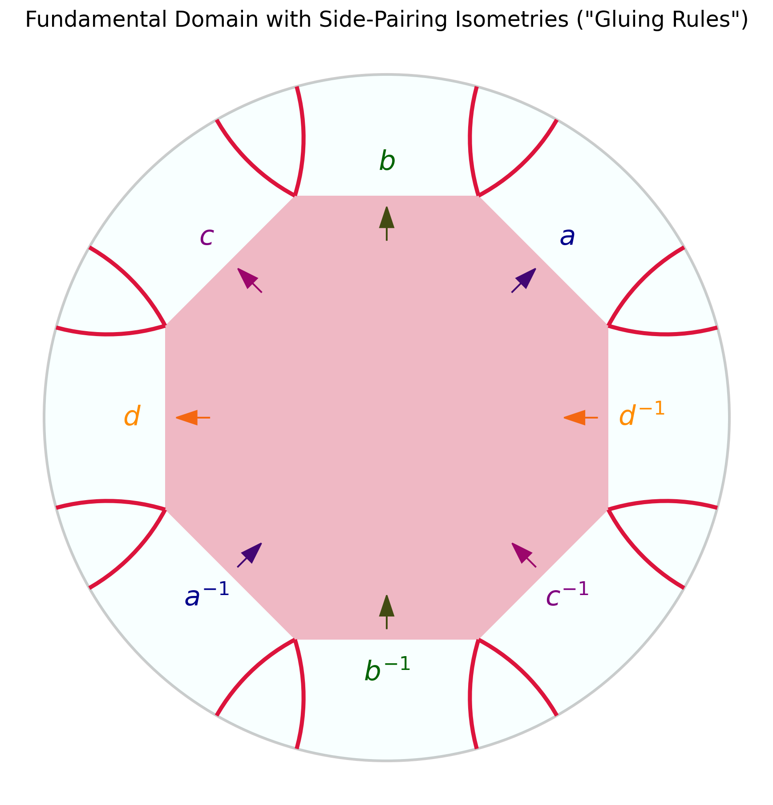
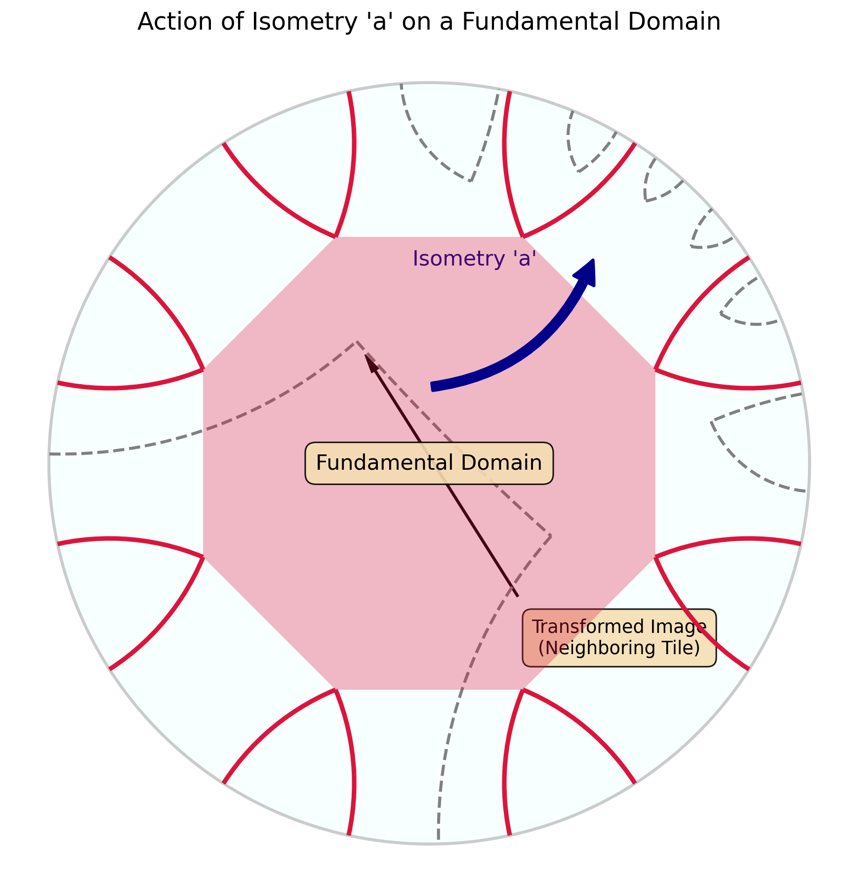
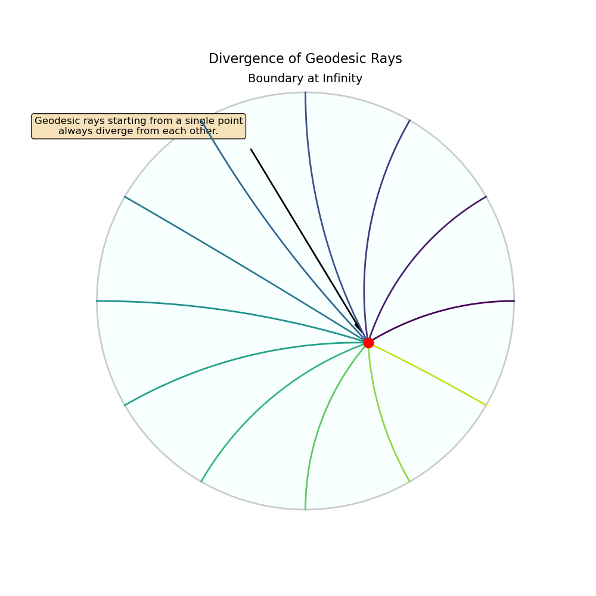
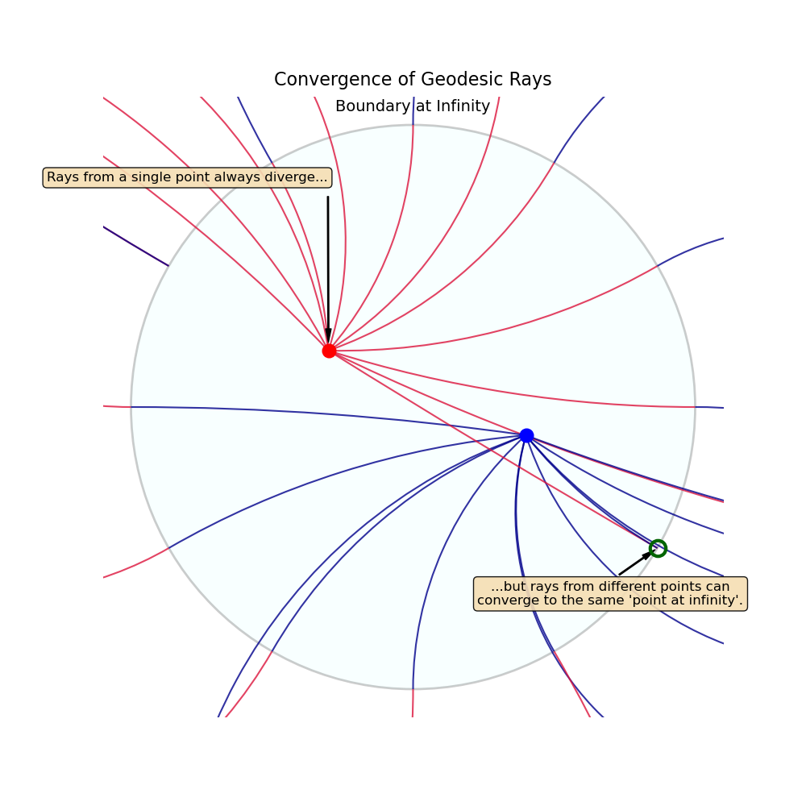
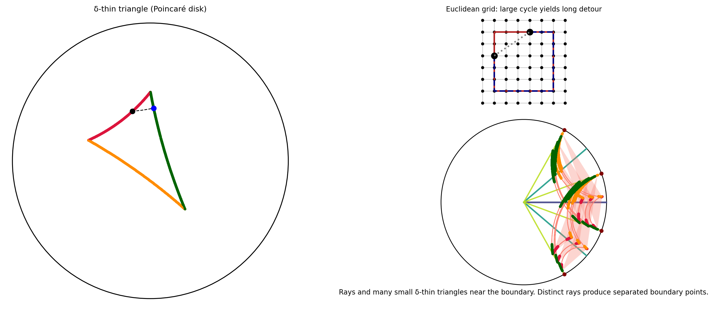

# An Introduction to Hyperbolic Geometry

Hyperbolic geometry is a fascinating and non-intuitive type of non-Euclidean geometry. While Euclidean geometry describes flat surfaces like a sheet of paper, hyperbolic geometry describes surfaces with constant negative curvature, like the surface of a saddle or a Pringles chip. This negative curvature leads to a space that expands exponentially, having "more room" than flat space.

This property makes it a natural mathematical language for describing concepts in the AdS/CFT correspondence, where a vast amount of information on a boundary is encoded within a higher-dimensional bulk.

## The Parallel Postulate: A Fundamental Break {#parallel-postulate}

The core difference between Euclidean and hyperbolic geometry lies in Euclid's fifth postulate, the **parallel postulate**. For centuries, mathematicians tried to prove this postulate from the other four, believing it had to be a necessary truth. The failure to do so led to the discovery of non-Euclidean geometries in the 19th century.

* **Euclidean Geometry**: Given a line *L* and a point *P* not on *L*, there is **exactly one** line through *P* that never intersects *L*.

* **Hyperbolic Geometry**: Given a line *L* and a point *P* not on *L*, there are **infinitely many** lines through *P* that do not intersect *L*.

This single change has profound consequences for the nature of space.

### Formal Axiomatic Characterization {#axiomatic-characterization}

From a formal perspective, a geometry is a logical system built upon foundational statements called **axioms**. These axioms define the behavior of primitive objects like "points" and "lines". The distinction between geometries can be stated with mathematical precision.

* **The Euclidean System (Axiom of Parallels):** The system of Euclidean geometry is defined by a set of axioms, including one equivalent to Euclid's fifth postulate (often called Playfair's axiom):
    > *For every line L and for every point P that does not lie on L, there exists exactly one line M through P that is parallel to L.*
    In the language of formal logic, this is stated as:
    $$ \forall L, \forall P \notin L, \exists! M \text{ such that } P \in M \text{ and } L \cap M = \emptyset $$
    The symbol $\exists!$ means "there exists one and only one".

* **The Hyperbolic System (Axiom of Hyperbolic Parallels):** Hyperbolic geometry keeps the other axioms but replaces the parallel postulate with its negation:
    > *For every line L and for every point P that does not lie on L, there exist at least two distinct lines M1 and M2 through P that are parallel to L.*
    The formal statement becomes:
    $$ \forall L, \forall P \notin L, \exists M_1, M_2 \text{ such that } M_1 \neq M_2, P \in M_1, P \in M_2, \text{ and } L \cap M_1 = \emptyset, L \cap M_2 = \emptyset $$

This demonstrates that the distinction is not merely descriptive but is a fundamental choice at the deepest logical level. By choosing a different axiom, an entire, self-consistent universe of geometric theorems emerges.

    
    

        <b>Figure 1:</b> A comparison of the parallel postulate. The detailed Poincaré disk projection on the right shows how multiple distinct "straight lines" (geodesics) can pass through Point P without ever intersecting Line L. The orange dotted lines are the two "limiting parallels" that meet L only at infinity.
    

## The Poincaré Disk: A Conformal Map for Tessellations {#poincare-disk}

Because it's difficult to visualize a negatively curved surface embedded in our everyday 3D world, we use 2D models or "projections". The **Poincaré Disk** is one of the most powerful models, mapping the entire infinite hyperbolic plane to the interior of a unit circle. Its properties are essential for understanding how our discrete tessellations work.

### The Conformal Metric {#conformal-metric}

The model's power comes from its **metric**, which defines distance. An infinitesimal displacement $ds$ is given by:
$$ ds^2 = \frac{4(dx^2 + dy^2)}{(1 - r^2)^2} \quad \text{where } r^2 = x^2 + y^2 $$
As a point $(x, y)$ approaches the boundary where $r \to 1$, the denominator approaches zero, causing the hyperbolic distance $ds$ to blow up. This is how an infinite space is mapped to a finite area.

Crucially, the metric is **conformal**: it is a scaling of the Euclidean metric $dx^2 + dy^2$ by a factor $\frac{4}{(1-r^2)^2}$. This means that while lengths are distorted, **angles are preserved**. The angle measured between two intersecting lines in the Poincaré disk is the true hyperbolic angle between them. This property is what makes constructing tessellations possible.

### Geodesics as Orthogonal Arcs {#geodesics}

A "straight line" (a **geodesic**) in this model is the shortest path between two points. These paths take the form of:
1.  A diameter of the disk.
2.  An arc of a circle that intersects the boundary circle at a right angle (90°).

### Tessellations as Geodesic Polygons {#tessellations}

The connection to our library is that a hyperbolic tessellation is built from regular polygons whose sides are **geodesic arcs**. A tessellation is specified by the **Schläfli symbol** $\{p, q\}$, meaning it is a tiling by regular *p*-gons, with *q* of them meeting at each vertex.

Because the space is curved, the angles of these polygons are different from their Euclidean counterparts. The interior angle $\alpha$ of a regular hyperbolic *p*-gon in a $\{p, q\}$ tiling is fixed by the requirement that *q* of them must fit perfectly around a vertex:
$$ \alpha = \frac{2\pi}{q} $$
For this to form a valid *p*-gon, the sum of its interior angles, $p \times \alpha$, must satisfy the **Gauss-Bonnet theorem**, which relates the area of a polygon to its angles.

Let's consider the `{5, 4}` tiling used in our library:
* We tile the space with pentagons (*p*=5).
* Four pentagons meet at each vertex (*q*=4).
* The interior angle of each pentagon must therefore be $\alpha = 2\pi / 4 = \pi/2$ (90°).

In Euclidean geometry, a regular pentagon has 108° angles, so this would be impossible. In hyperbolic geometry, the negative curvature allows the pentagon's sides to curve inwards, reducing the angles to 90° and allowing four of them to fit perfectly. The `HyperbolicBuilding` class algorithmically constructs this tiling by repeatedly gluing these geodesic pentagons together according to the $\{5, 4\}$ rule.

    
    

        <b>Figure 2:</b> A view of a single {5, 4} pentagon. The red sides are geodesic arcs, and the negative curvature of the space allows their interior angles to be exactly 90°.
    

    
    

        <b>Figure 3:</b> The regular tessellation of the squares (4, 4), pentagons (5, 4), hexagons (6, 4), and '15-gons' (15, 4). The three hyperbolic lattices with p ≥ 5 are displayed in the Poincaré disk. <a href="https://www.researchgate.net/figure/The-regular-tessellation-of-the-squares-4-4-pentagons-5-4-hexagons-6-4-and_fig1_381190053">Source</a>
    

### Isometries and the Construction of Manifolds {#isometries}

An **isometry** is a transformation that preserves distances, and thus the entire structure of the geometry. In the Poincaré disk, the orientation-preserving isometries are a class of functions known as **Möbius transformations**. Any such transformation can be represented as a composition of a hyperbolic translation and a rotation.

Using complex numbers where $z = x + iy$, the general form of an isometry is:
$$ f(z) = e^{i\phi} \frac{z - z_0}{1 - \bar{z_0}z} $$
* **Hyperbolic Translation ($z_0$)**: The parameter $z_0$ (a complex number with $|z_0| < 1$) defines a translation that moves the point $z_0$ to the origin. Unlike a Euclidean shift, this is a non-linear transformation that warps the space accordingly.
* **Rotation ($\phi$)**: The parameter $e^{i\phi}$ represents a standard Euclidean rotation by an angle $\phi$ about the origin.

The `PoincareIsometry` class in our library encapsulates this mathematical object. Its real power comes from its use in constructing complex manifolds. Instead of tiling a simple plane, we can define a **fundamental domain** (a single polygon) and a set of isometries that act as "gluing instructions" for its sides. By identifying pairs of sides via these isometries, we can "stitch" the space together to create surfaces with non-trivial topologies, like a two-holed torus. The `construct_building` method uses this approach to generate a much richer class of geometries than simple tilings.

    
    

        <b>Figure 4:</b> The "blueprint" for a complex surface. This solid octagon is the fundamental domain, and the labels show the side-pairing rules. For example, the isometry 'a' glues the top-left side to its inverse 'a⁻¹' on the bottom-right.
    

    
    

        <b>Figure 5:</b> Applying the isometry 'a' maps the solid red fundamental domain to the dashed gray neighboring copy, meeting along the paired side and illustrating how repeated side-pairings tile the space.
    

## Key Properties and Consequences {#key-properties}

### Exponential Growth {#exponential-growth}
The most significant feature of hyperbolic space is its **exponential growth**. The circumference and area of a circle grow exponentially with its hyperbolic radius $r$, not polynomially as in flat space.
* **Circumference**: $C = 2\pi \sinh(r)$
* **Area**: $A = 2\pi (\cosh(r) - 1)$
This is why we say hyperbolic space has "more room," a property that is the geometric analogue of the exponential growth of information in holographic systems.

## The Boundary at Infinity: The Gromov Boundary {#gromov-boundary}

The visual boundary in the Poincare Disk model is a representation of a deep mathematical concept called the **Gromov boundary**. This "boundary at infinity" is a fundamental feature of all hyperbolic spaces.

    
    

        <b>Figure 6:</b> The (6,4,2) triangular hyperbolic tiling. The triangle group corresponding to this tiling has a circle as its Gromov boundary. <a href="https://en.wikipedia.org/wiki/File:Hyperbolic_domains_642.png">Source</a>
    

### Geodesic Rays and Their Endpoints {#geodesic-rays}
Imagine standing at a point and shining a laser beam. This beam travels along a **geodesic ray**. In hyperbolic space, two different rays starting from the same point will diverge exponentially fast and never meet again. The Gromov boundary $\partial X$ is the set of "endpoints" for all possible geodesic rays. Two rays, $\gamma_1(t)$ and $\gamma_2(t)$, are considered equivalent (ending at the same boundary point) if they stay a finite distance from each other forever:
$$ \sup_{t \ge 0} d(\gamma_1(t), \gamma_2(t)) < \infty $$

    
    

        <b>Figure 7:</b> Geodesic rays originating from a single point (red dot) inside the disk. Due to the negative curvature of the space, these rays diverge from each other exponentially fast.
    

    
    

        <b>Figure 8:</b> While rays from a single point diverge, rays from two different points (red and blue dots) can be aimed to converge on the exact same point at infinity (highlighted in green).
    

### Gromov's Thin Triangles and the Tree-Like Nature {#thin-triangles}
What makes this boundary so well-behaved is a property called **Gromov hyperbolicity**. A key feature of these spaces is that their geodesic triangles are "$\delta$-thin."

* **Thin Triangles**: A geodesic triangle is $\delta$-thin if any point on one side is within a distance $\delta$ of the union of the other two sides. This property prevents the formation of large, grid-like structures and forces the space to have a **tree-like** nature at large scales.

    
    

        <b>Figure 9:</b> Left: a geodesic triangle in the Poincaré disk; points on each side that lie within hyperbolic distance δ of the union of the other two sides are shaded, illustrating the δ‑thin triangle property. 
    

    

        Top right: a Euclidean grid with a large square cycle highlighted, showing that perimeter detours between opposite midpoints along the cycle are long. 
    

    

        Bottom right: a hyperbolic, tree‑like expansion inside the disk; geodesic rays and many small geodesic triangles near the boundary are drawn, demonstrating that analogous detours admit short center‑based shortcuts. Together these panels show that δ‑thinness prevents persistent large grid‑like loops and forces tree‑like large‑scale geometry, producing a well‑behaved, totally disconnected boundary.
    

### The Holographic Connection {#holographic-connection}
The Gromov boundary is the linchpin connecting the bulk geometry to the boundary physics in AdS/CFT.

* **The Boundary is the Universe**: In holography, the Gromov boundary of the bulk (Anti-de Sitter space) **is** the lower-dimensional spacetime where the quantum field theory lives.
* **Points as Degrees of Freedom**: Each point on the Gromov boundary corresponds to a degree of freedom (like a qubit) in the boundary's quantum system.

The connection is made quantitative by the Ryu-Takayanagi formula, which relates the entanglement entropy $S_A$ of a boundary region $A$ to the area of a minimal surface $\gamma_A$ in the bulk that ends on the boundary of A:
$$ S_A = \frac{\text{Area}(\gamma_A)}{4G_N} $$
When our `HyperbolicBuilding` class constructs a tiling, it creates a discrete version of this bulk space. A key computational challenge is to algorithmically find the minimal surface $\gamma_A$.

### Finding the Minimal Surface: A Computational Note {#geodesic-computation}
In our discrete model, the "minimal surface" corresponds to the **shortest path** (a geodesic) in the graph of interconnected polygons. This path is found using the `find_geodesic_a_star` function, and its "Area" is taken to be the number of polygons it contains.

The algorithm finds this path using a specific metric and search strategy:
* **The Metric (Graph Distance):** The "distance" between adjacent polygons is defined as exactly 1. The algorithm seeks to minimize the sum of these costs, which is equivalent to finding the path that traverses the fewest number of polygons. This is a **graph distance** metric, distinct from the continuous hyperbolic metric.
* **The Search Algorithm (Dijkstra's):** The `find_geodesic_a_star` function is implemented with a zero heuristic, making it functionally equivalent to **Dijkstra's algorithm**. This is an **uninformed search** that explores the graph by expanding outwards from the starting polygon in all directions, layer by layer. While this guarantees finding the correct shortest path according to the graph distance metric, its computational cost grows exponentially with the size of the geometry, making it a primary performance bottleneck.
