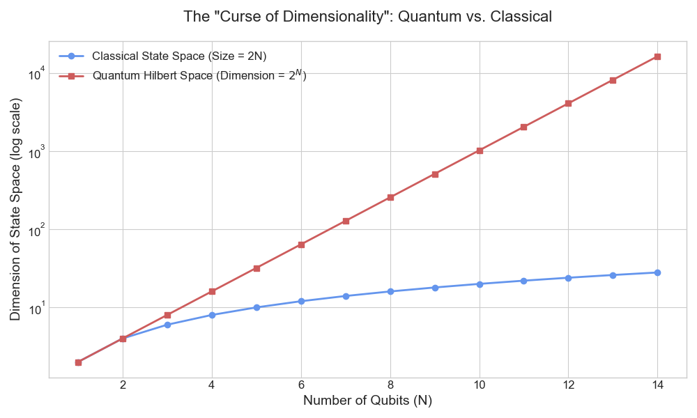
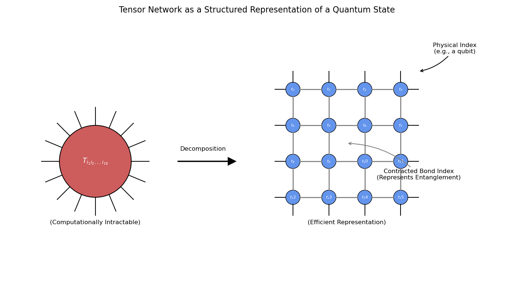
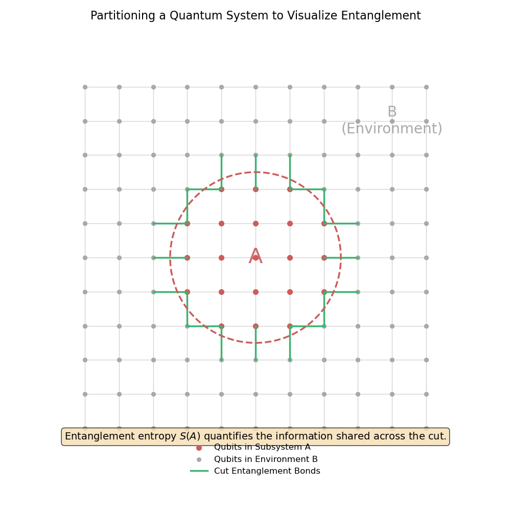
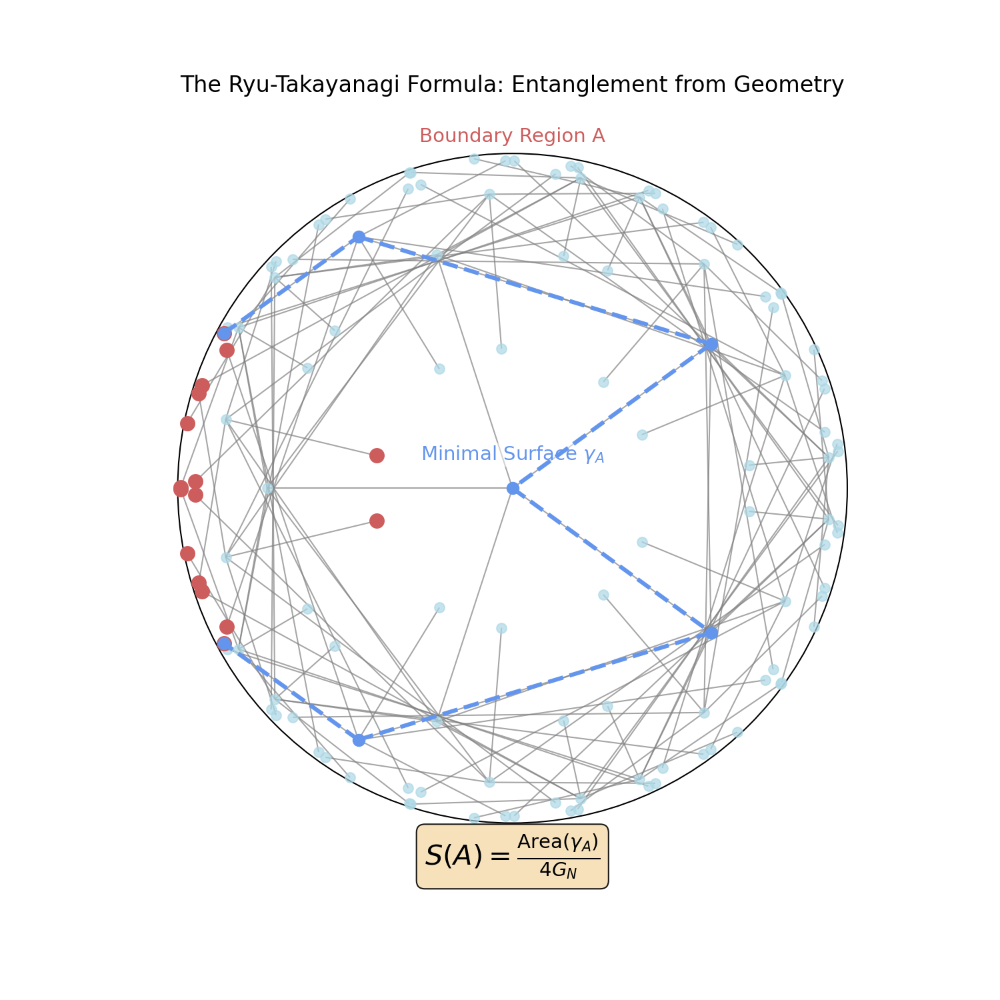

# An Introduction to Holographic Quantum States

Why should the study of quantum mechanics, a theory of particles and probabilities, be concerned with the geometry of curved space? For most of its history, the answer was "it isn't"—geometry was seen as the fixed, classical stage upon which quantum drama unfolds. The holographic principle, however, reveals a much deeper and more startling relationship: the geometry of spacetime may not be fundamental at all, but rather an **emergent property** of the quantum information encoded in a system.

This document explores this connection, motivating why the geometric tools discussed in `THEORY.md` are essential for understanding the structure of complex quantum states.

## The Challenge: The Immensity of Quantum Space

A classical system of *N* particles can be described by listing the position and momentum of each one. The amount of information needed grows linearly with the number of particles. A quantum system is fundamentally different.

### Hilbert Space and the Curse of Dimensionality

The state of a quantum system is represented as a vector in a high-dimensional complex vector space called a **Hilbert space**. For a single two-level system (a qubit), this space is 2-dimensional.

However, for a system of *N* qubits, the dimensions of the Hilbert space grow **exponentially**. The total Hilbert space is the tensor product of the individual spaces, so its dimension is $2^N$. To describe the state of just 300 qubits—a tiny system by macroscopic standards—you would need more complex numbers than there are atoms in the visible universe.

  
   
  <em>Figure 1: A comparison of the exponential growth of a quantum system's Hilbert space versus the linear growth of a classical system's state space. Note that the diagram is transformed via a log-transformation.</em>

This "curse of dimensionality" makes a direct simulation or description of most many-body quantum systems computationally impossible. We need a more efficient way to represent the physically relevant states.

## Tensor Networks: A Geometric Language for Quantum States

**Tensor networks** are a powerful theoretical and computational tool designed to overcome this challenge. They provide a graphical language for representing complex quantum states by decomposing the enormous state vector into a network of smaller, interconnected tensors.

The crucial insight is that the **structure of this network imposes a geometry** on the quantum state. This geometry dictates which parts of the system are directly entangled and how information is distributed. For holographic states, this geometry is specifically a form of **[hyperbolic geometry](../theory/THEORY.md#introduction)**, where the network of tensors forms a **[hyperbolic tessellation](../theory/THEORY.md#tessellations)**.

  
   
  <em>Figure 2: A large, complex tensor (left) is decomposed into a structured network of smaller, interconnected tensors (right), making it computationally tractable.</em>

## Entanglement: The Fabric of Quantum Space

The connections, or "bonds," in a tensor network represent the most fundamental feature of quantum mechanics: **entanglement**.

### Intuitive Description

Entanglement is a form of correlation that is stronger than anything possible in the classical world. If two particles are entangled, their fates are inextricably linked, no matter how far apart they are. Measuring a property of one particle instantly influences the properties of the other.

Think of entanglement as the "information" in a quantum system that is not stored in the individual parts, but in the **relationships between them**. Entanglement entropy is the tool we use to quantify this shared information.

### Formal Description: Entropy as a Measure of Entanglement

This intuition is formalized using the **density matrix**. For a quantum system in a pure state $|\psi\rangle$, its density matrix is $\rho = |\psi\rangle\langle\psi|$.

If we partition this system into two subsystems, A and B, we can find the state of A by performing a **partial trace** over the degrees of freedom in B. This gives us the **reduced density matrix for A**:

$$\rho_A = \text{Tr}_B(\rho)$$

  
   
  <em>Figure 3: A quantum system is partitioned into a subsystem of interest (A) and its environment (B). Entanglement entropy quantifies the correlations "cut" by this partition.</em>

The **von Neumann entropy** (or entanglement entropy) of subsystem A is then defined as:

$$S(A) = -\text{Tr}(\rho_A \log \rho_A)$$

This value is zero if and only if A is not entangled with its complement. It is the precise, quantitative measure of the "quantum-ness" of the correlations between different parts of a system.

## Holography: Geometry from Entanglement

The final leap is to connect these ideas. If the structure of a a tensor network is a geometry, and the connections of the network represent entanglement, could the geometry of spacetime itself be a macroscopic manifestation of a microscopic entanglement pattern? This is the core idea of the "It from Qubit" movement and the holographic principle.

The **[Ryu-Takayanagi formula](../theory/THEORY.md#holographic-connection)** is the Rosetta Stone for this idea. It states that for these holographic quantum states, the entanglement between a region of qubits on the boundary is calculated by the area of a minimal surface cutting through the bulk geometry.

> **Entanglement (Quantum Information)** $\iff$ **Area (Geometry)**

  
   
  <em>Figure 4: The Ryu-Takayanagi formula. The entanglement entropy of the boundary region A (red) is proportional to the area of the minimal surface γ_A (blue dashes) in the bulk.</em>

This suggests a profound paradigm shift:

* We can view the bulk hyperbolic space not as a pre-existing stage, but as an **emergent geometry** constructed from the entanglement structure of the boundary quantum state.
* The **[exponential growth](../theory/THEORY.md#exponential-growth)** of hyperbolic space is the geometric dual of the immense information capacity of an entangled quantum system.

Our library is a tool to explore this duality. By constructing hyperbolic geometries as described in `THEORY.md`, we are implicitly defining the entanglement patterns of a holographic quantum state. By calculating entanglement entropy, we are probing the emergent geometric properties of that state.
